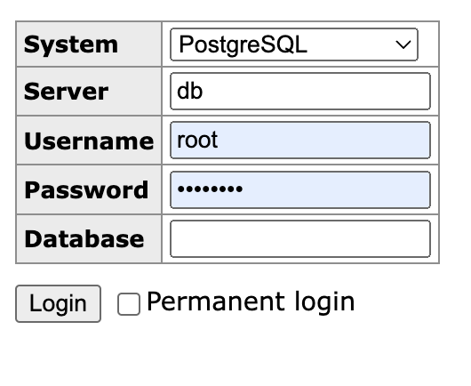

# Job Tracker

### Getting started with Postgres

1. Download and install Docker desktop
2. From the command line run `docker volume create pgdata`
3. Run `docker-compose up --build` to run Postgres and Adminer at http://localhost:
   If you get this error:

  ```
  PostgreSQL Database directory appears to contain a database; Skipping initialization
  ```

   Run `docker-compose down --volumes`
4. Log in


### Creating and running a migration

1. Please read the section on [migrations](https://sequelize.org/docs/v6/other-topics/migrations/) in the Sequelize docs. sequelize-cli is already installed but make sure you have run `npm install`.
_tldr_: Migrations are a convenient way to create and modify tables
2. Create a migration for a table you want to create. See this [example](https://sequelize.org/docs/v6/other-topics/migrations/#creating-the-first-model-and-migration)
3. A migration file in `/migrations` and a corresponding model files in `/models` should be created
4. The autogenerated by sequelize-cli file in `models/index.js` will autoload your models into the project. You can require them into a file using `const { User } = require("{path_to_root}/models");`
5. Enter `npx sequelize-cli db:migrate` to run your migration


